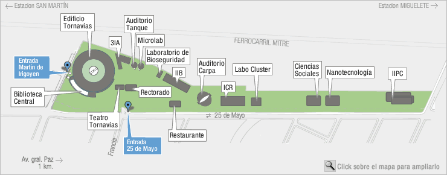
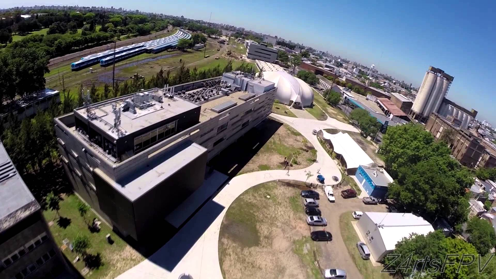

## POSICIONES DOCTORALES

### INSTITUTO DE INVESTIGACIONES BIOTECNOLÓGICAS (IIB)

El laboratorio de Genómica y Bioinformática de la UNSAM ofrece oportunidades
para hacer investigación en el marco de su programa de Doctorado. Se ofrece
posibilidad de presentación a beca Agencia o CONICET en algunas de estas líneas
de investigación:

### Immunomics of Chagas Disease: large scale analysis of antibody responses associated with *Trypanosoma cruzi* infections

El laboratorio está utilizando microarrays de péptidos de última generación
(peptide chips) para el descubrimiento de nuevos marcadores serológicos con
potencial utilidad en diagnóstico, y en el estudio a escala genómica de la
respuesta inmune montada durante la Enfermedad de Chagas.

**Perfil buscado:** Licenciad@s en Biotecnología, Binformática, Cs. de la
Computación, Física, o Biología con orientación en Bioinformática, con
excelentes calificaciones, experiencia en programación, buen manejo del inglés
(o gran atrevimiento) y muchas ganas. 

**Financiamiento:** FONARSEC FITS-CHAGAS-003 (2012-2015), FONCYT PICT-2013-1193 (2014-2016).

**Publicaciones relacionadas:** 

 * Towards high-throughput immunomics for infectious diseases: use of next-generation peptide microarrays for rapid discovery and mapping of antigenic determinants. Carmona SJ *et al.* (2015). Mol Cell Proteomics 14: 1871. [Full Text](http://dx.doi.org/10.1074/mcp.M114.045906)
 * Diagnostic peptide discovery: prioritization of pathogen diagnostic markers using multiple features. Carmona SJ *et al.* (2012). PLOS One 7: e50748. [Full Text](http://dx.doi.org/10.1371/journal.pone.0050748)

***

### Computational Drug Discovery: development of methods for repurposing bioactive compounds for infectious diseases.

El laboratorio está enfocado desde hace un tiempo en el desarrollo de
métodos y herramientas computacionales para guiar el proceso de
identificación y desarrollo de nuevas drogas con potencial actividad contra
patógenos humanos. Como parte de este proyecto, buscamos desarrollar
estrategias quimiogenómicas comparativas para reposicionar compuestos
bioactivos hacia enfermedades infecciosas. 

**Perfil buscado:** Licenciad@s en Biotecnología, Binformática, Química, o
Biología con excelentes calificaciones, experiencia en programación en
cualquier lenguaje, buen manejo del idioma inglés (o gran atrevimiento). 

**Financiamiento:**  FONCYT PICTO-Glaxo-2013-0067 (2014-2016)

**Publicaciones relacionadas:**

 * A multilayer network approach for guiding drug repositioning in neglected diseases. Berenstein AJ, Magariños MP, Chernomoretz A, Agüero F (2015). Submitted.
 * TDR Targets: a chemogenomics resource for neglected diseases. Magariños MP *et al* (2012). Nucleic Acids Research 40: D1118.
 * Identification of attractive drug targets in neglected-disease pathogens using an *in silico* approach. Crowther GJ *et al.* (2010). PLOS Neglected Tropical Diseases 4: e804.
 * Genomic-scale prioritization of drug targets: the TDR Targets database. Agüero F *et al.* (2008). Nature Reviews Drug Discovery 7: 900.

***

### Otras Publicaciones 

 * [PubMed](http://1.usa.gov/12p0C2W) (most recent first)
 * [Google Scholar](http://scholar.google.com.ar/citations?user=zycaIZQAAAAJ) (most cited first)

### Contacto 

Si estás interesad@, escribí a [fernan@unsam.edu.ar](mailto:fernan@unsam.edu.ar)

***

### Donde estamos

El Instituto de Investigaciones Biotecnológicas (IIB) está dentro del nuevo
campus Miguelete de la UNSAM, a cuadras de la Av. Gral Paz y con conexión
directa y rápida mediante [colectivos o
tren](http://www.unsam.edu.ar/home/_c_llegar.asp) hacia Retiro (Ferrocarril
Mitre), Puente Saavedra, Liniers y barrios cercanos (Vicente Lopez,
Saavedra, Nuñez, Belgrano, Villa Urquiza, Devoto, Villa del Parque). 

Plano del campus Miguelete:

Foto aérea del IIB en el campus Miguelete:
 
